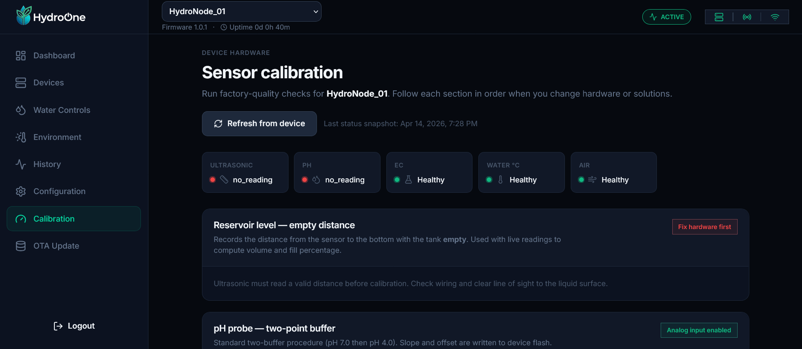
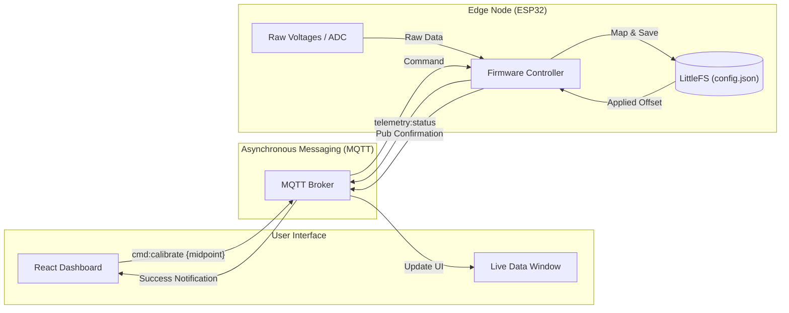

# Calibration Guide

Precise readings are the difference between a thriving garden and a failed crop. HydroponicOne provides built-in tools to calibrate your sensors via the dashboard.

## 🧪 pH Calibration (Two-Point)

1.  Prepare pH 4.0 and pH 7.0 buffer solutions.
2.  Submerge the probe in **pH 7.0** solution.
3.  Wait for the reading to stabilize on the Dashboard.
4.  Click **Calibrate PH7** in the UI.
5.  Rinse the probe and repeat for **pH 4.0**.

## ⚡ EC (Conductivity) Calibration

1.  Dry the EC probe completely.
2.  Click **Calibrate Dry** (sets the base voltage).
3.  Submerge in a known solution (e.g., 1.41 mS/cm).
4.  Enter the solution value in the Dashboard and click **Calibrate Scale**.

## 📏 Reservoir (Tank) Calibration

This sets the "Empty Distance" for your ultrasonic sensor.

1.  Ensure your reservoir is completely empty.
2.  The ultrasonic sensor should have a clear path to the bottom.
3.  Click **Calibrate Empty** on the Dashboard.
4.  The system will now measure water height as `EmptyDistance - CurrentReading`.

---

### Troubleshooting
Having issues with readings? See [**Step 6: Troubleshooting**](./06_TROUBLESHOOTING.md).
