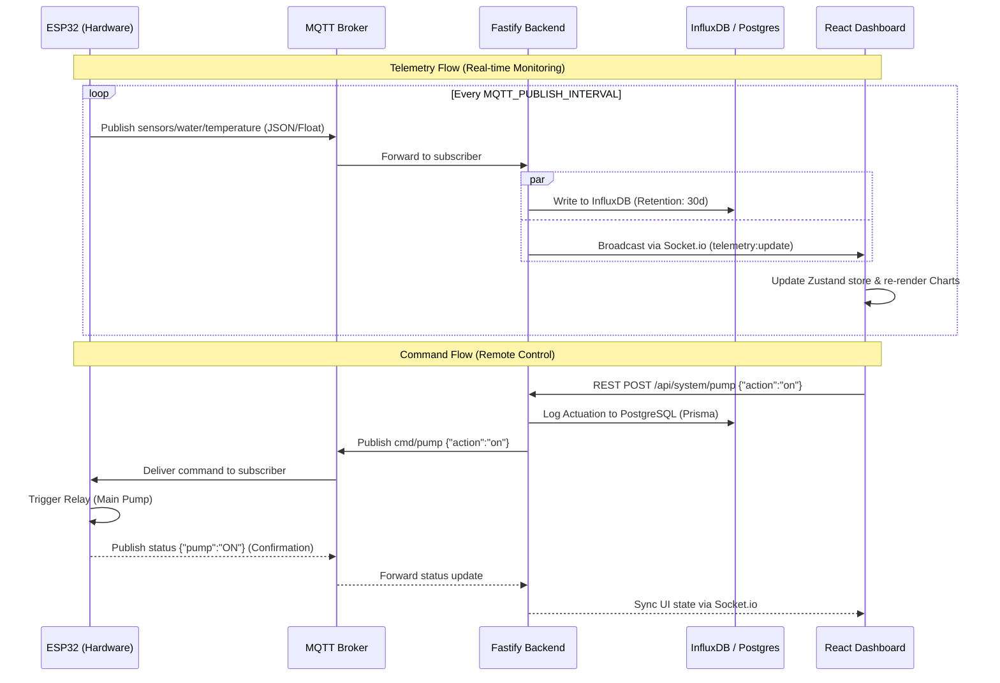

# MQTT v5 Technical Specification

HydroponicOne utilizes **MQTT v5** as its primary real-time communication protocol. All topics are prefixed with the Base Topic (default: `HydroponicOne`) and the Device Name (default: `HydroNode_01`).

All topics are structured as: `{MQTT_BASE_TOPIC}/{SYSTEM_NAME}/...
e.g. `HydroponicOne/HydroNode_01/sensors/water/temperature`

## 📈 Telemetry Topics (Device -> Cloud)

The following topics are used by the device to publish sensor data and health metrics.

| Topic Path | Data Type | Description |
| :--- | :--- | :--- |
| `sensors/water/temperature` | `Float` | Water temperature in Celsius. |
| `sensors/air/temperature` | `Float` | Ambient air temperature in Celsius. |
| `sensors/air/humidity` | `Float` | Relative air humidity (%). |
| `sensors/air/pressure` | `Float` | Atmospheric pressure (hPa). |
| `sensors/water/ph` | `Float` | Calibrated pH value. |
| `sensors/water/ec` | `Float` | Calibrated Electrical Conductivity (mS/cm). |
| `sensors/reservoir/distance` | `Float` | Distance to water surface from ultrasonic sensor (cm). |
| `sensors/water/level_percent` | `Float` | Reservoir fill percentage (0-100%). |
| `sensors/water/level_litres` | `Float` | Calculated water volume in Litres. |
| `power/battery` | `Float` | Battery voltage (V). |
| `status` | `JSON` | Device health snapshot (RSSI, Heap, Uptime). |
| `sensors` | `JSON` | Optional summary payload containing all sensor data. |
| `heartbeat` | `String` | Timestamp/Uptime pulse sent every 60s. |

---

## 🎮 Control Topics (Cloud -> Device)

Command topics are used to trigger actions or update runtime configurations.

| Topic Path | Payload Schema | Purpose |
| :--- | :--- | :--- |
| `cmd/pump` | `{"action": "on\|off", "duration": ms}` | Trigger or stop the nutrient pump. |
| `cmd/mode` | `{"mode": "maintenance\|active"}` | Switch system operational state. |
| `cmd/config` | `Partial<ConfigJSON>` | Update device settings (Sleep, Intervals). |
| `cmd/ph` | `{"action": "calibrate", ...}` | Trigger pH calibration workflow. |
| `cmd/ec` | `{"action": "calibrate", ...}` | Trigger EC calibration workflow. |
| `cmd/tank` | `{"action": "calibrate"}` | Trigger tank level calibration. |
| `cmd/env` | `{"action": "light_on\|off\|..."}` | Toggle Environment actuators (Light/Fan). |
| `cmd/ota` | `{"url": "...", "md5": "...", ...}` | Dispatch OTA Firmware update. |
| `cmd/sensors` | `{"action": "status"}` | Force an immediate sensor refresh & status publish. |
| `cmd/test` | `{"type": "relay", "id": 0, ...}` | Low-level hardware diagnostic (requires `test_cmds` enabled). |

---

## 🚨 Diagnostics & Errors

| Topic | Purpose |
| :--- | :--- |
| `errors` | Outbound stream for critical runtime exceptions. |
| `diagnostics` | General hardware health alerts. |
| `status` (LWT) | The "Last Will" topic used to detect if the device has gone offline. |

## 🔄 Data & Control Flow

The following diagram illustrates the event-driven lifecycle of telemetry (outbound) and commands (inbound).

---

**Integration Level**: Professional IoT  
**QoS Strategy**: Level 1 (At least once) for critical commands.  
**Retain Policy**: Enabled for `status` (LWT) and `config` topics.
