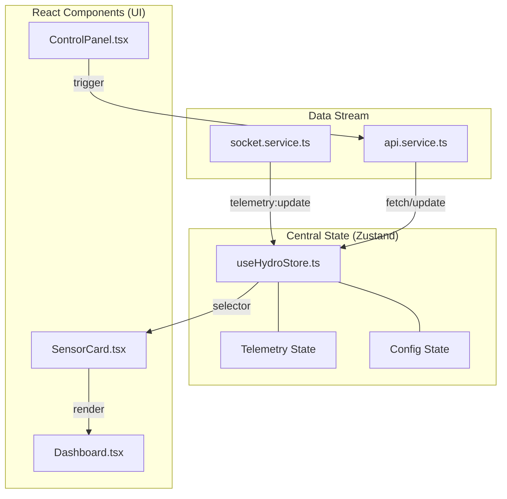
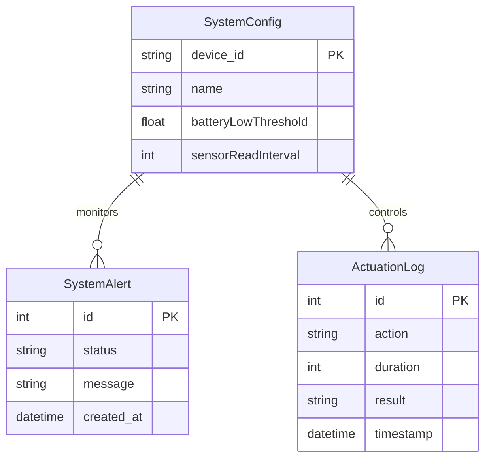
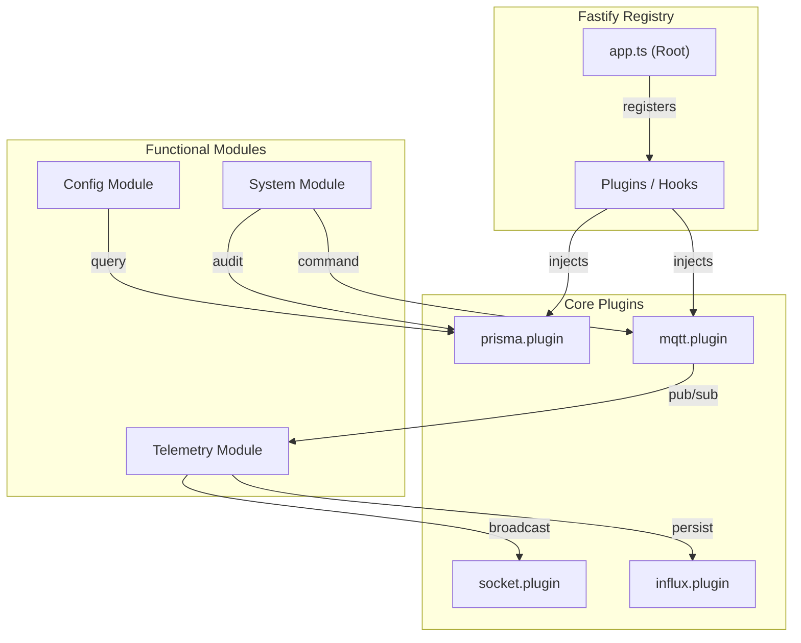

# Backend Architecture (Fastify)

The backend is built with Fastify, utilizing full TypeScript strictures and Zod type-provisioning.

### Plugins
- `mqtt.plugin.ts`: Manages single global MQTT connection wrapping Mosquitto/HiveMQ.
- `socket.plugin.ts`: Wrapper for `socket.io` enabling broadcast endpoints.
- `prisma.plugin.ts`: Global PrismaClient instance for PostgreSQL connections (configs, logs).
- `influx.plugin.ts`: Global InfluxDB WriteApi instance for telemetry ingest.

`services/socket.ts` connects to Fastify. Upon receiving `telemetry:update` payloads, it pushes directly into the Zustand store. React components passively listen to these hook changes and re-render efficiently.

### Modules Layout
- `telemetry/`: Subscribes to MQTT telemetry topics, validates schema using Zod, writes to Influx, and pushes updates via Socket.IO.
- `config/`: CRUD interface for `SystemConfig` managed via Prisma.
- `system/`: Command endpoints to activate Relays, Pumps, or Dosing logic. Triggers MQTT payload dispatch and inserts `ActuationLog` via Prisma.

### Models
- **SystemConfig**: Stores device settings (target pH, dosing thresholds, MQTT credentials).
- **SystemAlert**: Tracks diagnostic issues and health status across devices.
- **ActuationLog**: Records every time a relay or pump is triggered (manual or automated).

### Environment Requirements
Refer to `.env.example`. Requires MQTT broker access, PostgreSQL DB, and InfluxDB token.
