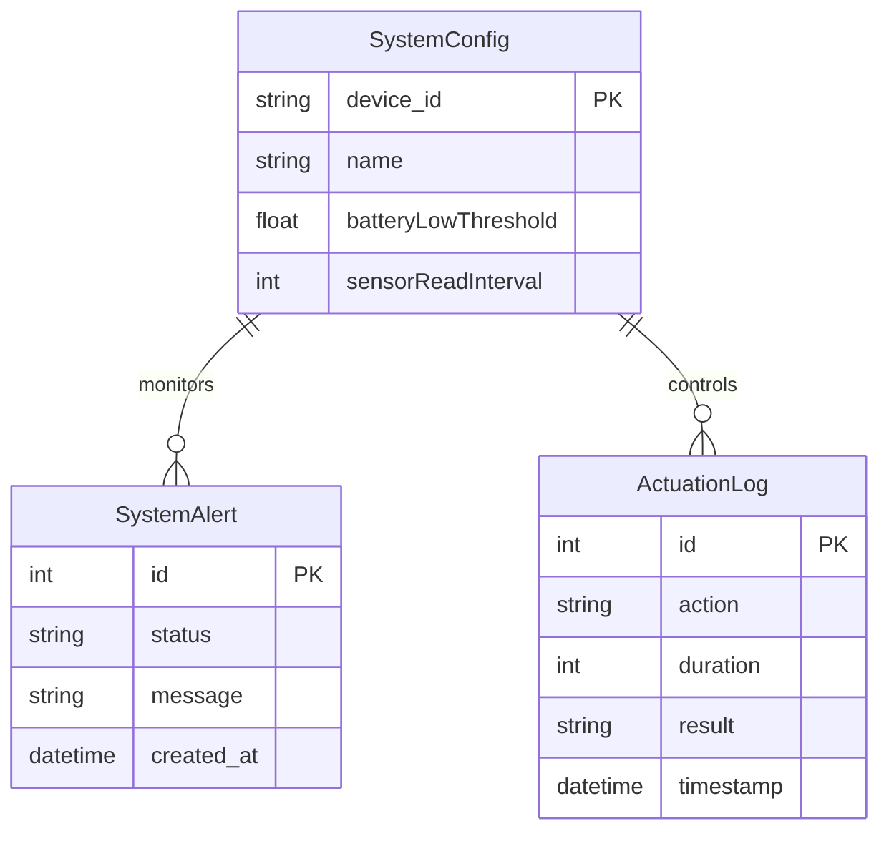

# Database Architecture

HydroponicOne uses a dual-database approach to handle structured configuration and high-frequency telemetry data efficiently.

## 🐘 PostgreSQL (Prisma)
Used for structured, relational data that requires ACID compliance and complex querying.

### Models
- **SystemConfig**: Stores device settings (target pH, dosing thresholds, MQTT credentials).
- **SystemAlert**: Tracks diagnostic issues and health status across devices.
- **ActuationLog**: Records every time a relay or pump is triggered (manual or automated).

### ORM: Prisma
We use Prisma for its type-safety and auto-generated client.
- **Schema**: `backend/prisma/schema.prisma`
- **Migration**: Handled via `npx prisma migrate dev`.

---

## 📈 InfluxDB (Telemetry)
A dedicated time-series database optimized for high-write telemetry workloads.

### Data Structure
- **Bucket**: `hydro-telemetry`
- **Measurement**: `sensors`
- **Tags**: `device_id`, `sensor_type`
- **Fields**: `value` (float)

### Retention Policy
By default, telemetry data is kept for **30 days** to ensure the database stays compact on edge servers, while providing enough history for trend analysis.

---

## 🔄 Data Synchronization
1.  **MQTT Ingest**: The backend subscribes to `HydroOne/HydroNode_01/sensors/#`.
2.  **Validation**: Zod schema validates the JSON payload.
3.  **Persistence**: 
    - Sensor data --> **InfluxDB**.
    - Health snapshot --> **PostgreSQL (Alerts)**.
4.  **Real-time Broadcast**: Data is immediately pushed to the **React Dashboard** via Socket.io.
