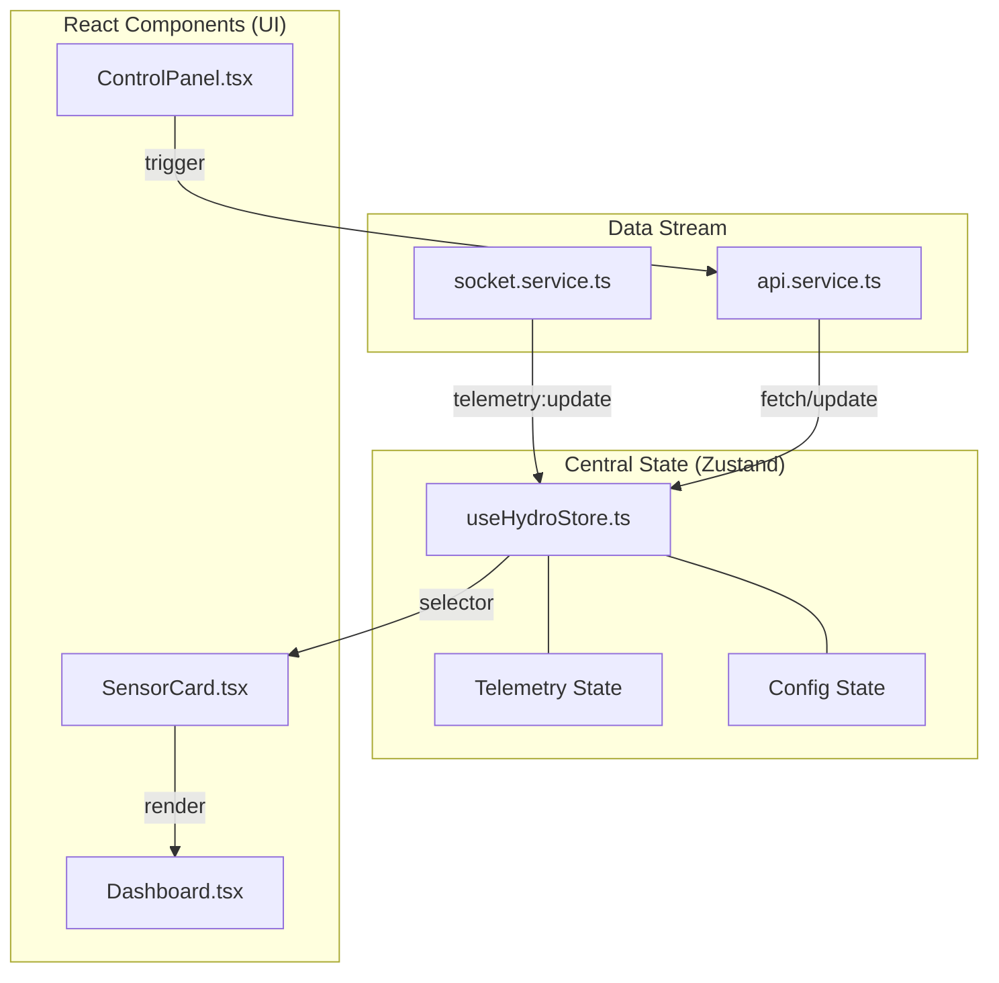

# Frontend Architecture (Vite + React)

The frontend built with lightweight Vite React SPA for maximum performance on low-power devices and easy static hosting.

### State Management
We use **Zustand** (`src/store/useHydroStore.ts`) to manage:
- Last known telemetry state
- Connectivity logic
- Configuration cache

### Real-Time Pipeline
`services/socket.ts` connects to Fastify. Upon receiving `telemetry:update` payloads, it pushes directly into the Zustand store. React components passively listen to these hook changes and re-render efficiently.

### Component Structure
- `Dashboard.tsx`: Main layout wrapper.
- `SensorCard.tsx`: Reusable modular display for environmental readouts.
- `ControlPanel.tsx`: Grid of interactive hardware triggers hooked up to `services/api.ts`.
- `Charts.tsx`: Time-series graph visualizations using Recharts.

### Theming
Uses **Tailwindcss V4** combined with `clsx` and `tailwind-merge` (`cn` helper) to apply modern, industrial dark themes using explicit CSS variables defined in `index.css`.
