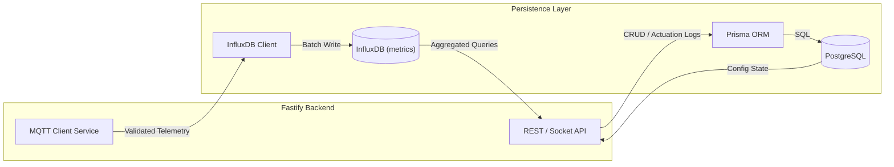

# HydroponicOne System Architecture

## Overview
HydroponicOne utilizes a high-performance, schema-driven architecture using Fastify and an edge-compatible React dashboard using Vite.

## Data Infrastructure
1. **ESP32 Firmware**: Written in modern C++, communicates via MQTT.
2. **Backend**: Fastify + Zod API with real-time Socket.io syncing.
3. **Frontend**: Vite + React + Zustand + Tailwind SPA.
4. **PostgreSQL (via Prisma)**: Manages relational state, configuration, and audit logs.
5. **InfluxDB**: High-performance storage for time-series telemetry.

## Data Flow
- **Telemetry**: Device -> MQTT (`HydroponicOne/HydroNode_01/sensors/...`) -> Fastify Backend (MQTT Subscriber) -> Parallel Write: InfluxDB + Socket.io broadcast -> Frontend Zustand store.
- **Commands**: Frontend Control Panel -> REST API (`POST /api/system/*`) -> Fastify Backend logs to Prisma -> Fastify publishes to MQTT (`HydroponicOne/HydroNode_01/cmd/*`) -> Device actions hardware.

